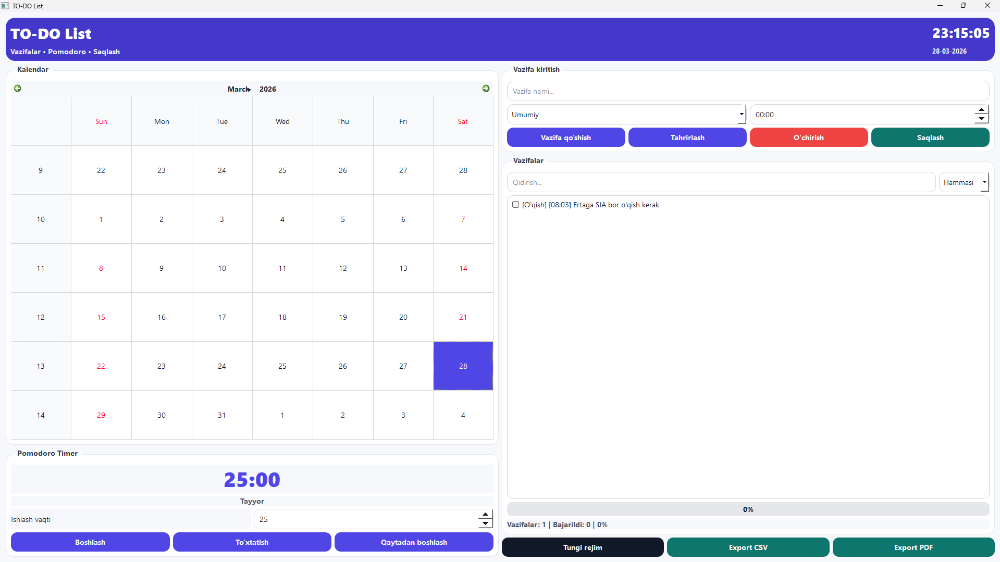
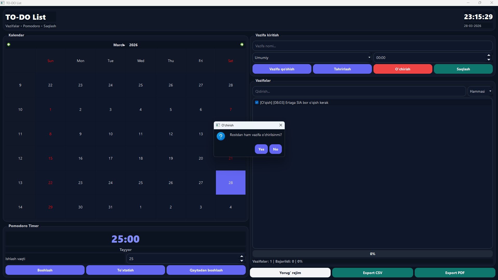

# 🧠 TO-DO List Desktop App — PyQt5 Planner

<div align="center">


### ⚡ Zamonaviy va Minimalistik Desktop Planner

*Kundalik vazifalarni boshqarish, vaqtni rejalashtirish va fokusni oshirish uchun yaratilgan kuchli TODO ilova.*

</div>

---

# 📌 Loyiha haqida

Bu loyiha — **PyQt5** yordamida yaratilgan zamonaviy **TODO / Planner desktop application** bo‘lib, foydalanuvchiga kundalik ishlarini tartibli boshqarish imkonini beradi.

Ilova quyidagilar uchun mo‘ljallangan:

* 📋 Vazifalarni rejalashtirish
* ⏰ Deadline nazorati
* 🎯 Fokusni oshirish
* 🍅 Pomodoro texnikasi yordamida samaradorlikni kuchaytirish
* 🌙 Zamonaviy dark/light interfeys

---

# ✨ Asosiy imkoniyatlar

## 📅 Task Management

✔ Vazifa qo‘shish
✔ Vazifani tahrirlash
✔ Vazifani o‘chirish
✔ Vazifalarni sana bo‘yicha saqlash
✔ Kategoriyalar bilan ishlash
✔ Deadline qo‘shish
✔ Bajarilgan vazifalarni belgilash

---

## 🔍 Search & Filter System

Ilova ichida kuchli qidiruv va filter tizimi mavjud:

* 🔎 Instant Search
* 📂 Filter Options:

  * All Tasks
  * Pending Tasks
  * Completed Tasks

---

## 🍅 Pomodoro Timer

Foydalanuvchi fokusini oshirish uchun integratsiya qilingan:

* ⏱ Start / Pause / Reset
* 🎯 Fokus rejimi
* ⚡ Ishlash vaqtini sozlash
* 🧠 Productivity workflow

---

## 🌙 Modern UI/UX

Minimalistik va professional interfeys:

* 🌞 Light Mode
* 🌑 Dark Mode
* 🕒 Real-time Clock
* ✨ Smooth va clean dizayn

---

## 📤 Export System

Vazifalarni eksport qilish imkoniyati:

* 📄 CSV Export
* 🧾 PDF Export

---

# 🖼️ Screenshots

## 🌞 Light Mode

<p align="center">
  
</p>

---

## 🌑 Dark Mode

<p align="center">
  
</p>

---

# ⚙️ Installation

## 📥 Repository clone qilish

```bash
git clone https://github.com/Beksult0n/TO-DO-List.git
cd TO-DO-List
```

---

## 📦 Kerakli kutubxonalarni o‘rnatish

```bash
pip install -r requirements.txt
```

---

# ▶️ Dasturni ishga tushirish

```bash
python todo.py
```

---

# 🛠️ EXE fayl yaratish (PyInstaller)

```bash
python -m PyInstaller --noconfirm --onefile --windowed ^
--name "TO-DO_List" ^
--icon "icon.png" ^
--add-data "todo.ui;." ^
todo.py
```

---

# 📁 Project Structure

```bash
TO-DO-List/
│
├── todo.py
├── todo.ui
├── requirements.txt
├── icon.png
├── light.png
├── dark.png
└── README.md
```

---

# 🚀 Technologies Used

* Python
* PyQt5
* Qt Designer
* PyInstaller
* CSV / PDF Export System

---

# 🎯 Future Updates

* 🔔 Notification System
* ☁ Cloud Sync
* 📱 Mobile Version
* 🧠 AI Productivity Assistant
* 📊 Statistics Dashboard

---

# ⭐ Support

Agar loyiha sizga yoqqan bo‘lsa:

🌟 Repository'ga star bosishni unutmang
🍴 Fork qilib o‘zingizga moslashtiring
📢 Loyihani boshqalar bilan ulashing

---

<div align="center">

### ⚡ Productivity starts with discipline.

</div>
